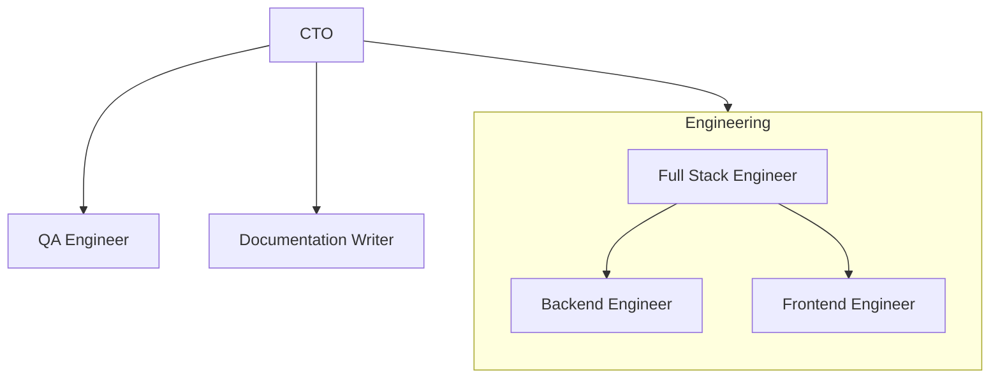

# Preface

We stand at a remarkable inflection point in software development. The integration of AI coding agents into our daily workflows isn't just changing *how* we write code. It's fundamentally reshaping what it means to be an engineer in 2026 and beyond.

This book is about my journey as an engineer exploring what changes when you stop working alone. It shares the experiments I’ve tried, the patterns that worked for me, and some infrastructure choices that helped me work more effectively while still holding on to the craft of good software development.

But more importantly, this is a guide for those ready to embrace the exponential age. If you've found yourself thinking "AI is only good for simple tasks" or "it doesn't understand real engineering," this book will challenge those assumptions and show you concrete strategies for leveraging AI effectively in professional software projects.

The future is already here. Let's explore how to work within it.

---

# Building Your AI Development Environment

## The Foundation: Meeting Everything Where It Lives

When I start a new project or join a new team, my first instinct hasn't changed. I dive deep into the existing codebase, understand the architecture, and map out the team dynamics. What *has* changed is the infrastructure I use to capture and process that information.

I've built custom tools that automatically record all meetings across Google Meet, Slack Huddles, and Zoom without notifying the participants and regardless of who owns the meeting. These recordings are processed locally to generate transcriptions, which are then analyzed to extract meeting notes, action items, and key decisions. Everything flows into Notion, organized by date and project.

Each meeting entry contains both the original transcription and AI-extracted summaries. Here's where it gets interesting: I use Claude Code to extend and enrich those from the transcription, leveraging my existing subscription without incurring additional costs. The AI doesn't just summarize. It identifies patterns, flags dependencies, and surfaces insights I might have missed in real-time conversation.

## The Context Layer: Custom Tools for Rapid Response

I've also developed a custom application that helps me draft Slack replies and work across different contexts: browser, notes, anywhere I need intelligent assistance. It includes shortcuts and embedded agents that significantly reduce the cognitive overhead of context-switching.

Think of it as an intelligent buffer layer between raw information and actionable output. Instead of manually typing responses or reformulating ideas across different platforms, the tool understands my working style, as I can create a custom instruction set that helps me communicate more effectively across all channels.

I'm thinking of connecting this tool to my note-taking app with a small RAG layer, so it can fetch relevant context from my notes whenever it's helpful.

## The Integration: Jira, Notion, and Contextual Awareness

When I onboard to a new project, I connect my Jira account to my agent system. This gives my AI assistants full visibility into:

- Which tickets I'm currently working on
- Related meeting discussions in Notion
- Historical context and decision-making patterns
- Team workflows and collaboration structures

The result is a living, evolving context that helps me deliver tasks correctly and efficiently without constantly forgetting critical details or losing track of why certain decisions were made.

## The Agent Workspace: A Living System

Perhaps the most fascinating part of this setup is the agent workspace in Notion. This space is exclusively managed by AI agents. I rarely touch it unless I spot an error that needs correction.

The agents populate this workspace with synthesized information about team structures, working patterns, individual roles, and how I fit into the broader project ecosystem. When I join a new team, I don't need to explicitly request onboarding documentation. My agents analyze available information and generate comprehensive onboarding materials automatically.

This also helps me psychologically. Everyone has different working styles, and understanding those styles can be challenging, especially in remote or distributed teams. My agents analyze communication patterns and working preferences, giving me insights into how best to collaborate with different team members.

It might sound like exaggeration, but the workspace sometimes feels like a living, conscious entity. A few years ago, this would have been completely impossible. Now, it's part of my daily reality.

## The Result: 360-Degree Project Awareness

This infrastructure ensures I'm always up-to-date with a comprehensive view of the project. Even before AI, my working style leaned toward knowing everything about a project regardless of my specific role. I'm genuinely interested in how all the pieces fit together, and that curiosity makes me a better engineer.

AI has simply amplified that capability, making it feasible to maintain that 360-degree awareness even as projects grow in complexity.

## Rethinking My Note-Taking Setup

I’m in the process of moving my notes from Notion to Obsidian. Notion has worked really well for me over the years, but Obsidian offers some advantages I’m interested in exploring. Now that AI agents can help maintain notes in Obsidian, I feel more comfortable using it. Earlier, I avoided it because getting the full benefit from Obsidian requires well-maintained notes, which can take a significant amount of time and effort.

---

# New Projects vs. Existing Projects

## The New Project Advantage: Setting Future-Proof Standards

Both new and existing projects offer unique opportunities for AI integration, but they require different approaches.

When starting from scratch, you have unprecedented freedom to establish standards, libraries, folder structures, and agent-specific rules aligned with the current AI era. This is critical: if you don't set up proper standards and processes from the beginning, there's a high risk of accumulating the "AI slop": low-quality, inconsistent code that might work but lacks coherence and maintainability.

In a new project, you can:

- Design folder structures optimized for AI navigation
- Establish naming conventions that improve AI comprehension
- Create clear separation of concerns that makes context engineering easier
- Define code review processes that leverage AI strengths while mitigating weaknesses
- Set up CI/CD pipelines with AI-aware quality gates

The key is being intentional about these choices upfront rather than trying to retrofit them later.

## The Existing Project Advantage: Standards Already in Place

Paradoxically, existing projects can actually be easier to integrate with AI tooling. Why? Because standards and processes are already established.

While you'll need time to set up workflows and familiarize your AI agents with the existing conventions, you're building on a foundation rather than creating one. The codebase itself serves as training data. Your agents can learn from existing patterns, understand the established architecture, and generate code that matches the existing style.

The challenge is different: instead of preventing AI slop from accumulating, you're ensuring AI-generated code meets existing quality standards and integrates seamlessly with human-written code.

---

## Context Engineering: The Critical Skill

Regardless of the project type or tools, context engineering matters enormously.

**Documentation**

I keep most of the documentation directly in the codebase using markdown files. These may include architectural decisions, key learnings, and sometimes Mermaid diagrams to explain flows visually. All the documentation is generated with the help of AI agents and it is much easier to capture context while the work is happening. I try to document things because I’m building software with the future in mind. Good context can make a huge difference for AI agents.
At the same time, I try to keep documentation focused on things that actually add value. What is worth documenting can vary depending on the situation, but the goal is always to keep it useful and reasonably up to date. 

**Context Comes With a Cost**

Claude Code provides various skills and commands to accelerate development, and they're genuinely useful. But here's my recommendation: rely primarily on plain Markdown files and standard CLI commands that you already use. Add specific CLI commands to files for your agents to follow. Review existing Claude skills to understand the patterns, then create your own minimal versions tailored to your project.

**Why token efficiency matters.** 

Every tool, every MCP server, every skill loads context into the model. That context has a cost: both in API charges and in how quickly you hit rate limits. A custom Markdown file with targeted CLI commands uses a fraction of the tokens compared to loading comprehensive MCP servers.

Even if you're using "unlimited" API services, those limits aren't truly unlimited. By being thoughtful about context, you can:

- Reduce token consumption significantly
- Decrease latency by loading less context
- Improve AI accuracy by providing more focused information
- Extend your effective rate limits

If you're using global MCP servers, disable any that aren't actively needed for your current project. Replace them with lightweight Markdown files containing the specific commands you actually use.

Think of it as moving from a general-purpose Swiss Army knife to a specialized tool kit designed exactly for your workflow.

---

# Multi-Agent Architectures and Coordination

## The Hierarchical Agent System

I use a multi-agent system where you can "hire" specialized agents: a CTO agent that can spawn full-stack agents, each with distinct responsibilities:

- Code review agents that focus on quality and standards
- Full-stack engineers that handle implementation
- Testing agents that ensure reliability
- Research agents that explore new technologies

This hierarchy allows different levels of coordination for specific tasks. When you need parallel workstreams or specialized expertise, you can delegate to purpose-built agents rather than trying to handle everything through a single generalist assistant.

## Why I Don't Use This Setup Full-Time

Here's the honest truth: I only spend $25 per month on my AI tooling. Trying to spend as little as possible helped me figure out patterns to get the most out of my current plan.

If I had access to a $100 or $200 monthly plan, I would absolutely run the full multi-agent setup for complex projects. The coordination overhead is worth it when you're working on large features or architecturally significant changes.

But for most day-to-day work, the cost-benefit doesn't justify running multiple concurrent agents. I reserve the hierarchical approach for specific scenarios where the parallelism and specialization provide clear value.

## Practical Multi-Agent Workflows

When I do use multi-agent coordination, here's how it typically works:

| # | Agent | Role |
|---|-------|------|
| 1 | Planning agent | Analyzes requirements and creates a structured plan |
| 2 | Research agent | Investigates unfamiliar technologies or patterns |
| 3 | Implementation agent | Writes the core functionality |
| 4 | Review agent | Performs quality checks and suggests improvements |
| 5 | Testing agent | Generates test cases and validates behavior |

Each agent has a focused context and clear responsibilities, which leads to better outputs than asking a single agent to juggle all these concerns simultaneously.

The key is knowing when to invest in this complexity versus when a single well-instructed agent is sufficient.

## Running AI Agents Like a Small Engineering Team

I'm also experimenting with an org-style multi-agent system, modeled after a real engineering organization. The diagram above represents the structure I use. At the top sits the CTO agent, which acts as the orchestrator responsible for planning work, delegating tasks, and coordinating the overall execution. Under this orchestrator sits the engineering group, which consists of specialized agents such as a Full Stack Engineer, Backend Engineer, and Frontend Engineer. Alongside the engineering team are supporting roles like a QA Engineer and a Documentation Writer.

In this setup the Full Stack Engineer often acts as the bridge between the frontend and backend agents. It helps coordinate implementation details and ensures both sides of the system integrate correctly. The backend and frontend agents focus on their respective domains while the QA agent validates the work, checks for regressions, and ensures the expected behavior is met. The documentation writer captures important decisions, implementation notes, and technical explanations so knowledge does not get lost as the system evolves.

Work in this system is organized similarly to a Jira style board. Tasks are broken down into tickets and placed in columns such as Backlog, In Progress, Review, Testing, and Done. The CTO agent decomposes larger goals into tickets and assigns them to the appropriate agents. Each agent picks up its assigned ticket and starts working on it. As progress is made the ticket moves across the board until the work is completed. This approach makes it easier to run multiple agents in parallel while still keeping the workflow visible and structured.

In my experience this approach works phenomenally well. Giving each agent a clear role helps keep the reasoning focused and the outputs more structured. It starts to resemble a small engineering team working together rather than a single model trying to do everything at once.

One downside is token usage. Because several agents are communicating with each other, planning, implementing, and reviewing work, the number of prompts and responses increases quite a bit compared to a single agent workflow.

I also use Git worktrees or copy-on-write methods to work on multiple tasks simultaneously. However, I apply these techniques only when necessary and when they make sense for the situation.

That said, if cost is not a major concern and the work is valuable enough, I would still choose this setup. Even with the additional token usage it is often significantly cheaper than the cost of additional engineering time. For me it feels like working with a small virtual engineering team that can plan, build, review, test, and document continuously.

---

# Task Planning and Execution

## The Planning Phase

When I start working on a task, my workflow begins with a simple instruction to my agent: "Check the ticket and my meeting notes, then generate a plan."

For small tasks, I typically don't review the plan in detail. The agents are smart enough to understand requirements and execute based on established rules and the project's `CLAUDE.md` file. Over time, I've built trust in the system through consistent results.

For large tasks requiring deeper thinking and architectural decisions, I review and iterate on the plan. The agent does solid foundational work (breaking down the problem, identifying dependencies, outlining implementation steps), but this is where my engineering knowledge adds crucial value.

I'll inject specific design patterns, suggest different architectural approaches, or call out edge cases that require human judgment. This is where traditional engineering experience remains essential: knowing *which* design pattern fits a given scenario, understanding trade-offs between different approaches, and applying battle-tested wisdom that comes from years of building systems.

## Execution and Review

Once the plan is finalized, execution is straightforward: "Execute the plan."

The agent works through the steps, writing code, updating files, running tests. When the task is complete, I manually review and test the output. Not because I don't trust the agent, but because I genuinely enjoy this part of the process. 

There's satisfaction in seeing how the agent interpreted requirements, appreciating clever solutions, and understanding the implementation details. It keeps me connected to the code rather than becoming purely managerial.

I also have a setup for AI-assisted testing. In practice, I don’t use it very often. Mostly because I try to be mindful of token usage and QA team is in a much better position to spend tokens on that part of the workflow.
But every once in a while I give in and run it myself. It turns out testing is one of the easiest parts once the workflow exists, and the best part is that the same setup can be reused again and again.

This review also creates a feedback loop. When I spot issues or opportunities for improvement, those observations inform how I instruct agents on future tasks.

---

# Getting Better with AI Coding Agents

## The Best Learning Path: Build an Agent

The most effective way to improve your use of AI coding agents is experimentation: work on real projects, encounter real problems, iterate on your approach.

But if I had to recommend a single accelerated learning path, it would be this: **build your own AI agent or AI-powered project from scratch.**

Not with a framework or pre-built service. Build it yourself, using APIs directly, understanding how prompts flow through the system, how context is managed, how responses are generated and validated.

By creating an agent that performs a specific task (even a simple one), you'll learn how these systems work under the hood. That understanding transforms your effectiveness with production AI tools like Claude Code, GitHub Copilot, or Cursor.

You'll develop intuition for:

- **How context windows affect behavior**
- **Why certain prompts work better than others**
- **How to structure information for optimal AI comprehension**
- **When to provide more context versus when less is more**
- **How to debug unexpected AI behavior**

Once you understand these concepts at a fundamental level, you'll be vastly better equipped to use AI agents in your projects, regardless of their type and size.

## Engineering Experience Still Matters

Here's an important reality check: your existing engineering experience and domain knowledge remain crucial.

If you're a web application engineer, you can't immediately jump into a professional Swift project and perform at the level of an experienced Swift engineer. The language, frameworks, idioms, and ecosystem patterns are different.

**Can you create a Swift application as a web engineer using AI?** Absolutely yes.

**Can you work as a Swift engineer on a professional Swift project?** No. Not without significant learning and experience.

**Can you maintain a Swift project as a web engineer?** Absolutely yes, especially with AI assistance to bridge knowledge gaps.

AI is a force multiplier, not a replacement for domain expertise. It amplifies what you already know and helps you learn faster, but it doesn't eliminate the need for understanding.

## Evolving Your Setup

My current infrastructure still requires active monitoring and evolution. I'm continuously moving more of my setup to Claude Code because it provides cohesively what I previously built manually.

But that evolution is ongoing. Every project teaches me something new about how to structure context, when to use which tools, and how to get better results from AI assistance.

If you find yourself thinking "AI is only good for basic coding" or "it doesn't understand design patterns or system engineering," there's a high probability you haven't yet discovered how to use AI correctly for your specific project.

Every project requires some customization. Identify what's not working, experiment with different approaches, and improve your setup after each use. Treat your AI workflow as a codebase itself: something to refactor, optimize, and enhance over time.

---

# The Evolution of Engineering Roles

## Why I've Become a Cross-Functional Engineer

Even before AI tools became part of my workflow, I've always been interested in multiple parts of building software. Product thinking, engineering decisions, and design details all naturally caught my attention. I liked understanding how things should work, not just how to implement them.

AI coding agents have changed that dynamic. Now I can move from idea to implementation much faster because many of the tasks that once required coordination can be handled with agents. They work at my pace and can quickly translate direction into working code or prototypes.

This doesn't reduce the importance of Experts. But it does make it easier for someone who already thinks across product, design, and engineering to execute ideas more quickly than before.

## The Double-Edged Sword of Easy Prototyping

When someone with weak product intuition can quickly generate a working prototype, they often do. The problem is that a working prototype of a poorly conceived feature is worse than no prototype at all. It creates review burden for the team, and there's psychological pressure to ship it because "it already exists."

I'm trying to be more thoughtful about this myself. Just because I *can* quickly build something doesn't mean I *should*. Taking time to think through whether a feature actually solves a real problem is more important than ever. Otherwise, I'm just creating work for others to review and potentially contributing to feature bloat.

The tools have gotten more powerful, which means the responsibility to use them wisely has increased proportionally.

## The Changing Shape of Expertise

Lately I've noticed something subtle in the way I work.

Tasks that once belonged to different roles now happen in the same sitting. I might start by thinking through a product decision, sketch how the interface should behave, and then move directly into implementing it. What used to require multiple handoffs can now happen in one flow.

Part of this is enabled by better tools. But part of it is simply practicality. Every handoff introduces friction, discussion, and delay. When the tools allow it, it often feels easier to carry the idea forward yourself.

This blending of roles isn't entirely new. Designers have long influenced product thinking. Frontend engineers have frequently stepped into design decisions. The boundaries were already shifting.

AI just seems to be accelerating the shift.

What I'm still trying to understand is what this means for deep experts. There will always be enormous value in someone who dedicates themselves entirely to a single craft. The engineer who understands distributed systems at a fundamental level. The designer who intuitively grasps user behavior. The product thinker who sees patterns others miss.

But the bar for that kind of expertise is going to be higher. Being good at one domain may not be enough anymore.

I think that companies will still rely on deep experts, but there may simply be fewer of them. Those roles will likely be reserved for people whose expertise is unmistakable. For the rest of us, the more durable path may be broader capability.

---

# Challenging Assumptions About AI Capabilities

## The Capability Gap Is Smaller Than You Think

I urge you: don't assume AI isn't capable of something just because your first attempt didn't work.

AI is already capable of handling all traditional development tasks. I'm not claiming it's perfect. It's not. But you need to understand the trajectory we're on and the level of work most of us actually do.

The vast majority of engineers aren't working on rocket guidance systems or autonomous vehicle control algorithms. We're building web applications, internal tools, data pipelines, mobile apps. These are problems that have largely been solved before.

**Can we do these things better?** Absolutely yes.

**Can AI do these things?** Absolutely yes.

**Can we guide AI to produce the desired output?** Absolutely yes.

## Discovering What's Possible

Over two years of intensive AI use, I've repeatedly encountered tasks I initially thought were impossible with AI assistance. In every case, I eventually discovered I simply didn't know *how* to achieve them with AI. Not because AI couldn't do them.

The solution was almost never "AI can't do this." It was "I need to provide context differently" or "I need to break this down into smaller steps" or "I need to use a different prompting strategy" or "I just don't know enough about the things I'm trying to create".

Understanding this shifts your mindset from "Can AI do this?" to "How can I help AI do this?"

## The 80/20 Rule Has Shifted

Remember a few years ago when people said "80% of development is Google search"? That was largely true. You'd encounter a problem, search for solutions, adapt Stack Overflow answers, integrate library documentation.

Now that same principle applies to AI. There are countless ways to use it effectively, and success still comes down to prompt engineering and context engineering: how well you use the tools at your disposal.

In the near future, this gap will close even further. The amount of expertise required to achieve great results with AI is dropping rapidly.

---

## The Six-Month Problem

Consider this: whatever AI model you're using today, you're likely six months behind the cutting edge.

In the AI era, six months is enormous. I consider a six-month gap equivalent to two years in traditional technology cycles.

If you evaluated Claude or GPT-4 six months ago and concluded "it can't do X," revisit that assumption today. Capabilities are expanding at a breathtaking pace.

This ramp-up will continue. Stagnation will eventually come (all exponential curves eventually level off), but I don't expect that for another 5 to 8 years.

---

# Preparing for the Exponential Age

## What "Exponential" Really Means

We're entering what I call the exponential age: a period where improvements compound at an accelerating rate.

Many people understand exponential growth intellectually but struggle to internalize what it means practically. In year one, progress might feel incremental. In year two, noticeable. By year five, unrecognizable from where you started.

We're currently in the early stages of this curve for AI-assisted development. What feels like remarkable progress today will seem quaint in two years.

## Staying Relevant

To remain effective as an engineer in this environment:

| Principle                             | Description                                                                                                                            |
| ------------------------------------- | -------------------------------------------------------------------------------------------------------------------------------------- |
| **Continuously experiment**           | What worked three months ago might already be obsolete. Staying curious and trying new approaches regularly is important.              |
| **Build fundamental understanding**   | Surface level tool knowledge becomes outdated quickly. A deeper understanding of how these systems work provides longer lasting value. |
| **Share what you learn**              | Progress accelerates when knowledge is shared openly and the community collaborates.                                                   |
| **Maintain engineering fundamentals** | Architecture, design patterns, and system thinking remain important even when implementation is assisted by AI.                        |
| **Embrace uncertainty**               | The direction of this space is still evolving. Being comfortable with ambiguity is an important skill to develop.                      |

## The Eventual Endpoint

Eventually, we'll reach a stage where you simply ask for what you want, and it gets done. No detailed prompts, no context engineering, no iterative refinement. Just natural conversation and delivered results.

We're not there yet. But we're closer than many people realize, and we're getting closer faster than most people expect.

The engineers who thrive in that environment will be those who learned to work *with* AI rather than around it, and who built intuition for what's possible and developed the judgment to guide intelligent systems toward valuable outcomes.

---

# Conclusion: The Work Ahead

The chapters in this book have shared one engineer's journey into AI-native development workflows. Your journey will look different: different tools, different projects, different constraints and opportunities.

But the underlying principles remain:

- **Build understanding of how AI systems actually work**
- **Engineer context thoughtfully to maximize effectiveness**
- **Iterate relentlessly on your workflows and setup**
- **Challenge assumptions about what's possible**
- **Maintain engineering craft while embracing new capabilities**
- **Prepare for acceleration because the pace will only increase**

The exponential age is coming. In many ways, it's already here.

The question isn't whether AI will transform software development. It already has.

The question is whether you'll be among those who shaped that transformation or among those who let it happen to them.

Choose to shape it. Start today. Build something.

The future is waiting.
